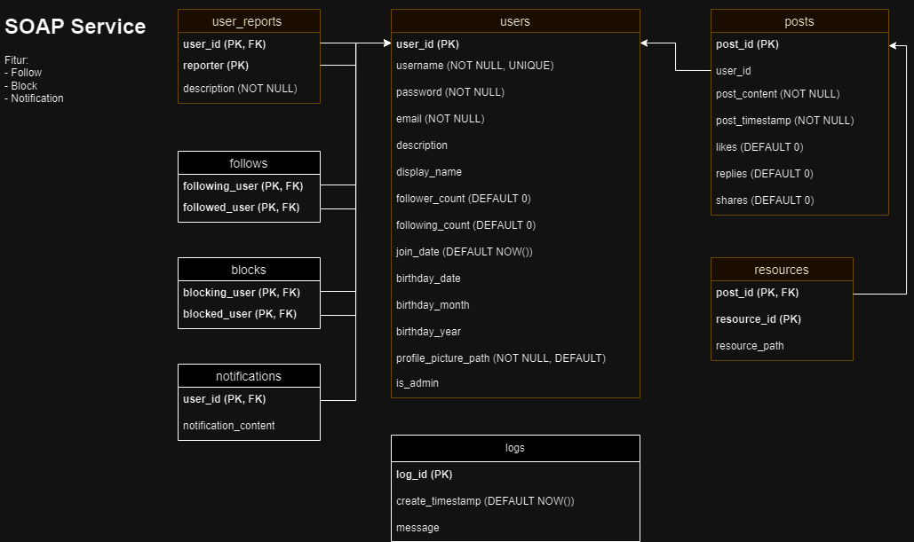

# Twitter SOAP Service

## Deskripsi Web Service

Service SOAP pada Twitter digunakan untuk mengelola data blokir, following, follower, dan notifikasi pengguna.

## Skema Basis Data

NOTE: Bagian yang terdapat pada basis data adalah entitas yang tidak berwarna/ber-_outline_ putih

## API Endpoints
Block Endpoints
| Nama Fungsi | Parameter | Deskripsi |
| --- | --- | --- |
| createBlock | int blockingUserId, int blockedUserId | untuk menambahkan data _user_ yang mem-_block_ user lainnya |
| deleteBlock | int blockingUserId, int blockedUserId | untuk menghapus data _user_ yang mem-_block_ user lainnya |
| getBlockFromBlockingUser | int blockingUserId | untuk memperoleh data _blocking_ antara seorang yang mem-_block_ dengan orang yang diblokir |
| getBlockFromBlockedUser | int blockedUserId | untuk memperoleh data _blocking_ antara seorang yang di-_block_ dengan orang yang membloknya |
| checkUserBlocking | int blockingUserId, int blockedUserId | untuk mencari tahu apakah ada _blocking_ antara kedua pengguna |

Follow Endpoints
| Nama Fungsi | Parameter | Deskripsi |
| --- | --- | --- |
| createFollow | int followingUserId, int followedUserId | untuk membuat data _follow_ antar kedua pengguna |
| deleteFollow | int followingUserId, int followerUserId | untuk menghapus data _follow_ antar kedua pengguna |
| getFollowFromFollowingUserId | int followingUserId | untuk memperoleh data pengguna yang di _follow_ oleh seorang _user_ |
| getFollowFromFollowedUserId | int followedUserId | untuk memperoleh data pengguna yang mem-_follow_ seorang pengguna |
| checkUserFollowing | int followingUserId, int followedUserId | untuk memastikan apakah ada relasi _follow_ antar kedua pengguna |

Notification Endpoints
| Nama Fungsi | Parameter | Deskripsi |
| --- | --- | --- |
| createNotification | int userId, String notificationContent | untuk membuat notifikasi untuk seorang pengguna |
| getNotificationFromUserId | int userId | untuk memperoleh semua notifikasi untuk seorang _user_ |
| getUnreadNotficationsFromUserId | int userId | untuk memperoleh semua notifikasi yang belum dibaca oleh seorang _user_ |
| setNotificationToRead | int notificationId | untuk mengubah status baca dari sebuah notifikasi |

## How to run

- clone this repository
- make sure you use jdk 8 (1.8)
- configure project structure to include lib jar
- create database and run migration file
- run project

## Pembagian Tugas

| NIM | Tugas |
| --- | --- |
| 13521057 | Block |
| 13521078 | Follow |
| 13521092 | Notification |
